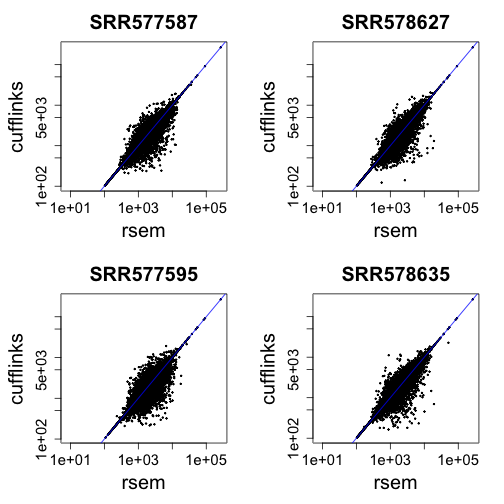
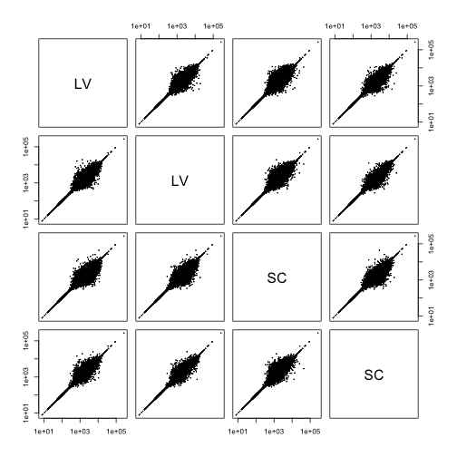
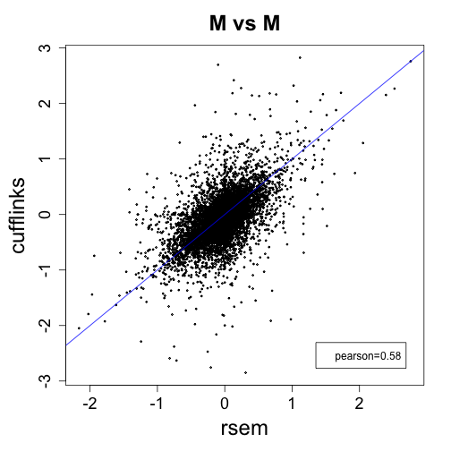

# Effective length normalization for count based methods

The count of RNA-seq reads which can be assigned to a gene depends on
a number of factors, including the abundance of that gene, the library
size, the length of the gene, sequence biases, the distribution of
fragment lengths and other factors. Comparing counts across samples and only
accounting for library size assumes that the gene-specific factors
other than gene abundance do not change across samples: for example
the length of the gene or the gene-specific effects of sequence
biases. These factors can also be included as model parameters into a
count based method, through the use of a gene-by-sample matrix of
normalization factors, or an offset matrix (on the log scale).

Here we show how to use the estimates of effective length for each
gene and each sample from the output of RSEM and Cufflinks as
normalization for count base methods DESeq2 and edgeR.

By gene length, or the
*effective length* of a gene, we refer to a gene's average transcript
length, averaging with respect to the abundance of each
transcript. For example, if a gene has two transcripts, one of length
1000 which accounts for 1/4 of the abundance, and one of length 2000
which accounts for 3/4 of the abundance, the effective length, or
average transcript length, would be:


```r
0.25 * 1000 + 0.75 * 2000
```

```
## [1] 1750
```

## Experiment files

The files are RNA-seq runs from the UCSD Human Reference Epigenome
Mapping Project. Note that these are individuals runs from experiments
which might have had multiple runs per experiment.
The files are in the order: left ventricle, sigmoid colon, left ventricle, sigmoid colon.


```r
(samples <- list.files("rsem_out"))
```

```
## [1] "SRR577587" "SRR577595" "SRR578627" "SRR578635"
```

```r
(condition <- c("LV","SC","LV","SC"))
```

```
## [1] "LV" "SC" "LV" "SC"
```

## RSEM output

The RSEM `.genes.results` files contain a column `effective_length`,
so all we have to do is aggregate this over samples.


```r
library(data.table)
rsem_list <- list()
for (i in seq_along(samples)) {
  cat(i)
  rsem_raw <- fread(paste0("rsem_out/",samples[i],"/",samples[i],".genes.results"))
  rsem_list[[i]] <- data.frame(eff_length=rsem_raw$effective_length, row.names=rsem_raw$gene_id)
}
```

```
## 1234
```

```r
head(rsem_list[[1]])
```

```
##                 eff_length
## ENSG00000000003    1917.31
## ENSG00000000005     786.96
## ENSG00000000419     891.14
## ENSG00000000457    5934.49
## ENSG00000000460    2617.80
## ENSG00000000938    1964.99
```

We combine these columns into one data frame, checking that the
`gene_id` is consistent.


```r
for (i in seq_along(samples)[-1]) {
  stopifnot(all(rownames(rsem_list[[i]]) == rownames(rsem_list[[1]])))
}
rsem <- do.call(cbind, rsem_list)
rsem <- as.matrix(rsem)
colnames(rsem) <- samples
head(rsem)
```

```
##                 SRR577587 SRR577595 SRR578627 SRR578635
## ENSG00000000003   1917.31   1880.45   2058.40   2073.04
## ENSG00000000005    786.96    781.80   1170.59    374.96
## ENSG00000000419    891.14    916.23    907.13    908.85
## ENSG00000000457   5934.49   3251.06   3243.15   3240.75
## ENSG00000000460   2617.80   3568.30   1491.74   2433.27
## ENSG00000000938   1964.99   2290.79   2225.01   2192.96
```

## Cufflinks output

In order to obtain the effective length, we use the
`isoforms.fpkm_tracking` file, and calculate the average length for
the isoforms, weighting by the ratio of each isoform's FPKM over the total
FPKM for all isoforms.


```r
library(dplyr)
cuff_list <- list()
for (i in seq_along(samples)) {
  cat(i)
  suppressWarnings({cuff_raw <- fread(paste0("cufflinks_out/",samples[i],"/isoforms.fpkm_tracking"))})
  res <- cuff_raw %>% group_by(gene_id) %>% summarize(eff_length=sum(length*FPKM)/sum(FPKM))
  cuff_list[[i]] <- data.frame(eff_length=res$eff_length, row.names=res$gene_id)
}
```

```
## 1234
```

```r
head(cuff_list[[1]])
```

```
##                 eff_length
## ENSG00000000003  2205.0650
## ENSG00000000005        NaN
## ENSG00000000419   996.7745
## ENSG00000000457  6364.0000
## ENSG00000000460  2653.6558
## ENSG00000000938  2316.1061
```

We combine these columns into one data frame, checking that the
`gene_id` is consistent.


```r
for (i in seq_along(samples)[-1]) {
  stopifnot(all(rownames(cuff_list[[i]]) == rownames(cuff_list[[1]])))
}
cuff <- do.call(cbind, cuff_list)
cuff <- as.matrix(cuff)
colnames(cuff) <- samples
head(cuff)
```

```
##                 SRR577587 SRR577595 SRR578627 SRR578635
## ENSG00000000003 2205.0650  2222.429  2284.611 2263.9102
## ENSG00000000005       NaN  1339.000  1339.000  677.3134
## ENSG00000000419  996.7745  1075.000  1075.000 1075.0000
## ENSG00000000457 6364.0000  4670.106  4307.202 4997.9242
## ENSG00000000460 2653.6558  3824.666  1751.074 2690.7123
## ENSG00000000938 2316.1061  2507.561  2360.064 2343.4121
```

## Genes with zero length

We have to remove gene's with zero length to continue.


```r
rsem.nz <- rsem[apply(rsem, 1, function(x) all(x > 0)),]
cuff.nz <- cuff[apply(cuff, 1, function(x) all(x > 0)),]
```

## Dividing out the geometric mean

As the count based methods have an intercept on the log scale, and 
the effect of effective length on counts is multiplicative, we can
divide each row by it's geometric median to produce a matrix which is
centered on zero in the log scale.


```r
norm.mat <- rsem.nz / exp(rowMeans(log(rsem.nz)))
head(norm.mat)
```

```
##                 SRR577587 SRR577595 SRR578627 SRR578635
## ENSG00000000003 0.9680983 0.9494867 1.0393382 1.0467303
## ENSG00000000005 1.0916744 1.0845165 1.6238477 0.5201462
## ENSG00000000419 0.9838251 1.0115246 1.0014782 1.0033771
## ENSG00000000457 1.5726358 0.8615287 0.8594325 0.8587966
## ENSG00000000460 1.0848411 1.4787374 0.6181912 1.0083702
## ENSG00000000938 0.9076811 1.0581767 1.0277912 1.0129864
```

## Input to DESeq2

Here we show the code for including these effective lengths in a
DESeq2 analysis. The `estimateSizeFactors` function corrects for
library size after taking into account the information in `norm.mat`.
Here we demonstrate using the normalization matrix on a matrix of
random counts, where the actual read counts for each gene and sample
would go.


```r
n <- nrow(norm.mat)
m <- length(samples)
library(DESeq2)
cts <- matrix(rpois(n*m,lambda=100),ncol=m)
coldata <- data.frame(condition=factor(condition), row.names=samples)
dds <- DESeqDataSetFromMatrix(cts, coldata, ~ condition)
dds <- estimateSizeFactors(dds, normMatrix=norm.mat)
```

```
## adding normalization factors which account for library size
```

```r
head(normalizationFactors(dds))
```

```
##      SRR577587 SRR577595 SRR578627 SRR578635
## [1,] 0.9387263 0.9384330 1.0651131 1.0657664
## [2,] 1.0585532 1.0718907 1.6641181 0.5296057
## [3,] 0.9539760 0.9997486 1.0263142 1.0216247
## [4,] 1.5249223 0.8514989 0.8807459 0.8744149
## [5,] 1.0519272 1.4615222 0.6335220 1.0267086
## [6,] 0.8801421 1.0458576 1.0532798 1.0314089
```

## Input to edgeR

One can provide the normalization factors as an offset to edgeR, which
needs to be on the natural log scale.  The offset matrix, like the
`normalizationFactors` in DESeq2, needs to account for library size.


```r
library(edgeR)
o <- log(calcNormFactors(cts/norm.mat)) + log(colSums(cts/norm.mat))
y <- DGEList(cts)
y$offset <- t(t(log(norm.mat)) + o)
```

## Exploring RSEM and Cufflinks estimates


```r
idx <- intersect(rownames(rsem), rownames(cuff))
length(idx)
```

```
## [1] 60083
```

```r
rsem <- rsem[idx,]
cuff <- cuff[idx,]
stopifnot(all.equal(rownames(rsem), rownames(cuff)))
colnames(rsem) <- condition
colnames(cuff) <- condition
```


```r
library(rafalib)
mypar(2,2)
for (i in 1:4) {
  suppressWarnings(plot(rsem[,i], cuff[,i],log="xy",cex=.3,main=samples[i],
       xlab="rsem", ylab="cufflinks"))
  abline(0,1,col="blue")
}
```

 


```r
suppressWarnings(pairs(rsem,log="xy",cex=.1))
```

 


```r
suppressWarnings(pairs(cuff,log="xy",cex=.1))
```

 


```r
mypar()
rsem_a <- rowMeans(rsem)
rsem_m <- log2(rowMeans(rsem[,c(2,4)])/rowMeans(rsem[,c(1,3)]))
plot(rsem_a, rsem_m, log="x", xlab="A", ylab="M", main="rsem", cex=.3)
```

```
## Warning in xy.coords(x, y, xlabel, ylabel, log): 2444 x values <= 0
## omitted from logarithmic plot
```

```r
abline(h=0,col="blue")
```

 


```r
mypar()
cuff_a <- rowMeans(cuff)
cuff_m <- log2(rowMeans(cuff[,c(2,4)])/rowMeans(cuff[,c(1,3)]))
plot(cuff_a, cuff_m, log="x", xlab="A", ylab="M", main="cufflinks", cex=.3)
abline(h=0,col="blue")
```

 


```r
mypar()
plot(rsem_m, cuff_m, xlab="rsem", ylab="cufflinks", main="M vs M", cex=.3)
legend("bottomright",legend=paste0("pearson=",round(cor(rsem_m,cuff_m,use="complete"),2)),inset=.05)
abline(0,1,col="blue")
```

 


```r
mypar()
plot((rsem_a + cuff_a)/2, rsem_m - cuff_m, xlab="(rsem A + cufflinks A)/2", ylab="rsem M - cufflinks M",
     main="M minus M", cex=.3, log="x")
abline(h=0,col="blue")
```

 
