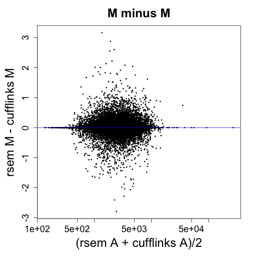

# Effective length

The files are RNA-Seq runs from the UCSD Human Reference Epigenome
Mapping Project. Note that these are individuals runs from experiments
which might have had multiple runs per experiment.

The files are in the order: left ventricle, sigmoid colon, left ventricle, sigmoid colon.


```r
(samples <- list.files("rsem_out"))
```

```
## [1] "SRR577587" "SRR577595" "SRR578627" "SRR578635"
```

```r
cond <- c("LV","SC","LV","SC")
```


```r
rsem_list <- list()
for (i in 1:4) {
  cat(i)
  rsem_raw <- read.delim(paste0("rsem_out/",samples[i],"/",samples[i],".genes.results"))
  rsem_list[[i]] <- data.frame(gene_id=rsem_raw$gene_id, eff_length=rsem_raw$effective_length)
}
```

```
## 1234
```


```r
head(rsem_list[[1]])
```

```
##           gene_id eff_length
## 1 ENSG00000000003    1917.31
## 2 ENSG00000000005     786.96
## 3 ENSG00000000419     891.14
## 4 ENSG00000000457    5934.49
## 5 ENSG00000000460    2617.80
## 6 ENSG00000000938    1964.99
```


```r
library(data.table)
library(dplyr)
cuff_list <- list()
for (i in 1:4) {
  cat(i)
  suppressWarnings({cuff_raw <- fread(paste0("cufflinks_out/",samples[i],"/isoforms.fpkm_tracking"))})
  cuff_raw <- as.data.frame(cuff_raw)
  cuff_list[[i]] <- data.frame(cuff_raw %>%
                               group_by(gene_id) %>%
                               summarize(eff_length=sum(length*FPKM)/sum(FPKM)))
}
```

```
## 1234
```


```r
head(cuff_list[[1]])
```

```
##           gene_id eff_length
## 1 ENSG00000000003  2205.0650
## 2 ENSG00000000005        NaN
## 3 ENSG00000000419   996.7745
## 4 ENSG00000000457  6364.0000
## 5 ENSG00000000460  2653.6558
## 6 ENSG00000000938  2316.1061
```


```r
rsem_summary <- data.frame(samp1=rsem_list[[1]]$eff_length, row.names=rsem_list[[1]]$gene_id)
for (i in 2:4) {
  stopifnot(all.equal(rownames(rsem_summary), as.character(rsem_list[[i]]$gene_id)))
  rsem_summary <- cbind(rsem_summary, newcol=rsem_list[[i]]$eff_length)
  names(rsem_summary)[i] <- paste0("samp",i)
}
```


```r
head(rsem_summary)
```

```
##                   samp1   samp2   samp3   samp4
## ENSG00000000003 1917.31 1880.45 2058.40 2073.04
## ENSG00000000005  786.96  781.80 1170.59  374.96
## ENSG00000000419  891.14  916.23  907.13  908.85
## ENSG00000000457 5934.49 3251.06 3243.15 3240.75
## ENSG00000000460 2617.80 3568.30 1491.74 2433.27
## ENSG00000000938 1964.99 2290.79 2225.01 2192.96
```


```r
cuff_summary <- data.frame(samp1=cuff_list[[1]]$eff_length, row.names=cuff_list[[1]]$gene_id)
for (i in 2:4) {
  stopifnot(all.equal(rownames(cuff_summary), as.character(cuff_list[[i]]$gene_id)))
  cuff_summary <- cbind(cuff_summary, newcol=cuff_list[[i]]$eff_length)
  names(cuff_summary)[i] <- paste0("samp",i)
}
```


```r
head(cuff_summary)
```

```
##                     samp1    samp2    samp3     samp4
## ENSG00000000003 2205.0650 2222.429 2284.611 2263.9102
## ENSG00000000005       NaN 1339.000 1339.000  677.3134
## ENSG00000000419  996.7745 1075.000 1075.000 1075.0000
## ENSG00000000457 6364.0000 4670.106 4307.202 4997.9242
## ENSG00000000460 2653.6558 3824.666 1751.074 2690.7123
## ENSG00000000938 2316.1061 2507.561 2360.064 2343.4121
```


```r
idx <- intersect(rownames(rsem_summary), rownames(cuff_summary))
length(idx)
```

```
## [1] 60083
```

```r
rsem_summary <- rsem_summary[idx,]
cuff_summary <- cuff_summary[idx,]
stopifnot(all.equal(rownames(rsem_summary), rownames(cuff_summary)))
colnames(rsem_summary) <- cond
colnames(cuff_summary) <- cond
```


```r
library(rafalib)
mypar(2,2)
for (i in 1:4) {
  suppressWarnings(plot(rsem_summary[,i], cuff_summary[,i],log="xy",cex=.3,main=samples[i],
       xlab="rsem", ylab="cufflinks"))
  abline(0,1,col="blue")
}
```

 


```r
#
suppressWarnings(pairs(rsem_summary,log="xy",cex=.1))
```

 


```r
#
suppressWarnings(pairs(cuff_summary,log="xy",cex=.1))
```

 


```r
mypar()
rsem_a <- rowMeans(rsem_summary)
rsem_m <- log2(rowMeans(rsem_summary[,c(2,4)])/rowMeans(rsem_summary[,c(1,3)]))
plot(rsem_a, rsem_m, log="x", xlab="A", ylab="M", main="rsem", cex=.3)
```

```
## Warning in xy.coords(x, y, xlabel, ylabel, log): 2444 x values <= 0
## omitted from logarithmic plot
```

```r
abline(h=0,col="blue")
```

 


```r
mypar()
cuff_a <- rowMeans(cuff_summary)
cuff_m <- log2(rowMeans(cuff_summary[,c(2,4)])/rowMeans(cuff_summary[,c(1,3)]))
plot(cuff_a, cuff_m, log="x", xlab="A", ylab="M", main="cufflinks", cex=.3)
abline(h=0,col="blue")
```

 


```r
mypar()
plot(rsem_m, cuff_m, xlab="rsem", ylab="cufflinks", main="M vs M", cex=.3)
legend("bottomright",legend=paste0("pearson=",round(cor(rsem_m,cuff_m,use="complete"),2)),inset=.05)
abline(0,1,col="blue")
```

 


```r
mypar()
plot((rsem_a + cuff_a)/2, rsem_m - cuff_m, xlab="(rsem A + cufflinks A)/2", ylab="rsem M - cufflinks M",
     main="M minus M", cex=.3, log="x")
abline(h=0,col="blue")
```

 
